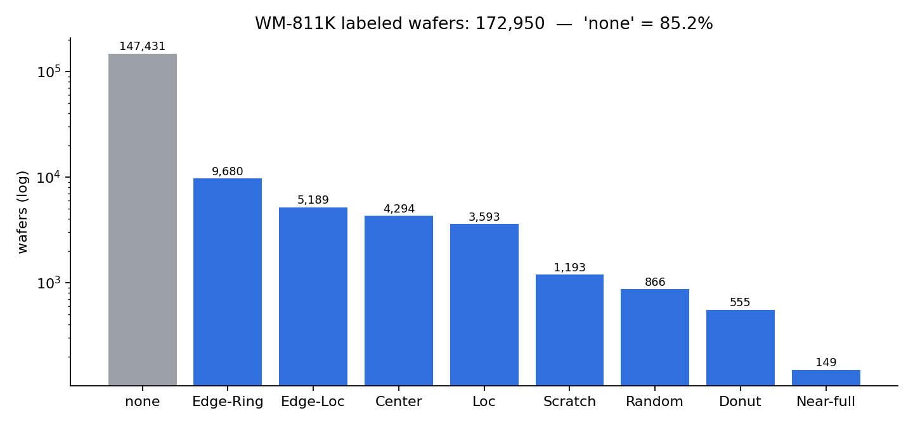
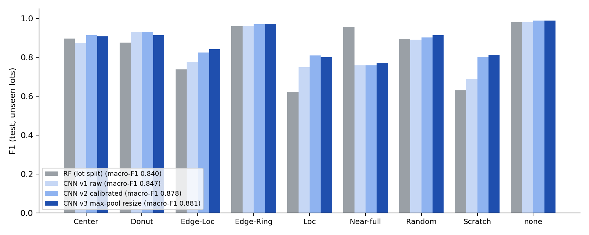
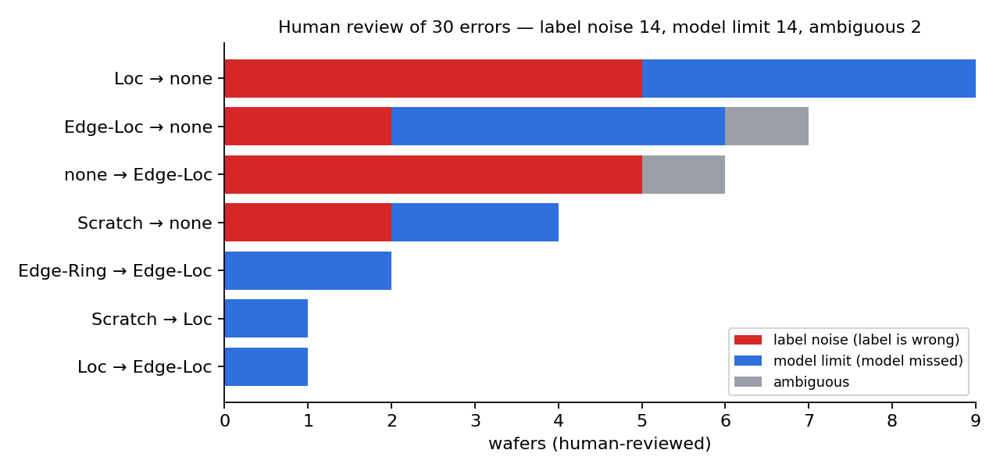
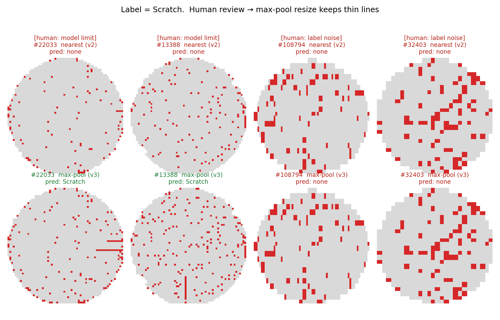
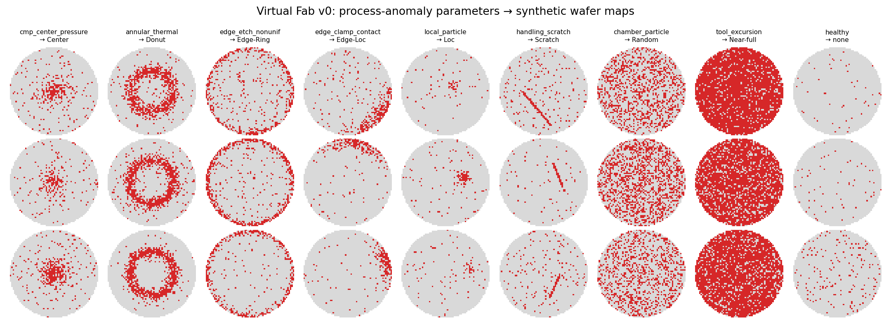

# Virtual Fab — Yield Lab

웨이퍼 맵 결함 패턴을 자동 분류하고, 패턴을 **공정 이상 원인 가설**로 연결하는 프로젝트입니다.
최종 목표는 공정 파라미터로 가상 웨이퍼 맵을 만드는 **Virtual Fab 시뮬레이터**를 만들고, 실제 팹 데이터로 검증하는 것입니다.

> 역할 분담: 문제 정의·지표·분할 설계·오류 판정·공정 가설은 사람이 직접 하고, 구현과 실험 실행은 Claude Code가 맡았습니다. 기록은 [AI_LOG.md](AI_LOG.md)에 있습니다.

## 1. 문제 정의
- **데이터:** WM-811K (실제 팹 웨이퍼 811,457장). 이 중 결함 패턴 라벨이 있는 172,950장을 사용했습니다. 라벨은 9종입니다.
- **핵심 난점:** 정상(`none`)이 **85.2%**로, 가장 많은 클래스와 가장 적은 클래스(Near-full 149장)의 차이가 약 990배입니다. 모든 웨이퍼를 "정상"이라고만 답해도 정확도가 85%라서 **정확도는 성공 기준이 될 수 없습니다.**
- **성공 기준:**
  - macro-F1(9개 클래스를 같은 비중으로 평균)과 클래스별 재현율로 평가합니다.
  - 평가는 **학습에 쓰지 않은 lot(10,762개 중 약 15%)** 에서만 합니다. 실제 운영에서 새로 들어오는 lot을 판독하는 상황을 그대로 재현하기 위해서입니다.



## 2. 접근
| 단계 | 방법 | 이유 |
|---|---|---|
| 베이스라인 | 도메인 특징 48개(반경 링별 불량률, 영역 밀도, Radon 투영, 최대 불량 영역 기하) + RandomForest | 해석이 쉬워 기준선으로 적합 |
| 모델 | 소형 CNN (64×64, 2채널), 회전·반전 증강, `none` 다운샘플 + 가중 CE | 공간 형태를 직접 학습 |
| 교정 | 다운샘플로 생긴 `none` 과소예측 편향을 logit bias로 보정 (validation에서만 탐색) | 학습 분포와 실제 분포의 차이를 보정 |
| 원인 연결 | Virtual Fab v0: 공정 이상 메커니즘 → 다이별 불량 확률장 → 가상 웨이퍼 맵 | 패턴과 공정 원인을 연결하는 가설 검증 |

## 3. 결과 (test = 학습에 쓰지 않은 lot 25,938장)
| model | macro-F1 | accuracy | Loc 재현율 | Scratch 재현율 |
|---|---|---|---|---|
| RF (특징 기반) | 0.840 | 0.964 | 0.50 | 0.50 |
| CNN v1 | 0.847 | 0.963 | 0.84 | 0.88 |
| CNN v2 (편향 교정) | 0.878 | 0.976 | 0.78 | 0.84 |
| **CNN v3 (v2 + max-pool 축소)** | **0.881** | **0.977** | 0.77 | **0.87** |

전체 표는 [results/summary.md](results/summary.md)에 있습니다.



## 4. 결과 검증
1. **lot 누수 점검:** 웨이퍼 단위 무작위 분할(0.827)과 lot 단위 분할(0.840)의 RF 성능 차이가 오차 범위 안이었습니다. 이 데이터에서는 lot 누수로 점수가 부풀려지는 효과가 크지 않다는 것을 확인했고, 그래도 보수적으로 lot 분할을 기본으로 씁니다.
2. **교정 전후 비교:** 교정 후 macro-F1이 0.847에서 0.878로, 정확도가 0.963에서 0.976으로 올랐습니다. 대신 Loc·Edge-Loc 재현율이 조금 내려갔습니다. 정상 웨이퍼를 불량으로 잘못 띄우는 오경보를 줄이는 대신 일부 약한 결함을 놓치는 트레이드오프이고, 운영에서는 bias 값을 공정 담당자가 조절하는 파라미터로 둘 수 있습니다.
3. **오분류 사람 판정 (30장):** 모델이 가장 많이 틀린 쌍 18장과, 높은 확신으로 틀린 12장을 직접 보고 판정했습니다. 결과는 **라벨 오류 14 / 모델 한계 14 / 애매 2**입니다. Loc→none, none→Edge-Loc 오류는 절반 이상이 원래 라벨이 틀린 경우라서, 이 구간의 점수는 모델보다 라벨 품질에 막혀 있습니다. 판정 원본은 [review_sheet.csv](results/errors/review_sheet.csv)에 있습니다.
   
4. **판정에서 원인을 찾아 교정 (v2 → v3):** Scratch 오류를 원본 해상도로 다시 보니, 원본에 선이 뚜렷한 웨이퍼가 **64×64 nearest 축소 과정에서 선이 통째로 사라진 것**이 원인이었습니다. 불량 칩이 하나라도 있으면 불량으로 남기는 max-pool 축소로 바꿔 재학습했습니다.
   - 사람이 "모델 한계"로 판정한 2장(#22033, #13388)은 Scratch로 바로잡혔습니다.
   - "라벨 오류"로 판정한 2장은 계속 none으로 예측돼, 사람 판정과 일치했습니다.
   - test 전체의 Scratch 정답은 150/179에서 **155/179**로 늘었고, macro-F1은 0.878에서 0.881이 됐습니다.
   - 단일 seed 결과라 전체 수치 개선폭은 작게 해석합니다. 핵심은 원인 규명과 개별 사례 교정입니다.
   
5. **알려진 약점:** Near-full은 test에 23장뿐이라 수치가 불안정합니다. 또 Edge-Loc 10장이 Near-full로 예측된 사례가 있어 라벨 노이즈 후보로 확인이 필요합니다.
6. **sim-to-real 일관성:** 실제 데이터로만 학습한 CNN이 Virtual Fab v0의 가상 맵(메커니즘별 300장)을 **의도한 패턴으로 91.7%** 분류했습니다. Center·Donut·Scratch는 100%였고, 가장 낮은 것은 Random(74%)입니다.
   - 생성기를 직접 설계했기 때문에 이 수치는 "가설이 실제 패턴의 핵심 형태를 담고 있다"는 일관성 점검입니다. 원인을 입증하는 결과는 아닙니다.



## 5. 패턴 → 공정 원인 가설 (Virtual Fab v0 메커니즘)
| 패턴 | 생성 메커니즘 | 공정 가설 |
|---|---|---|
| Center | 중심 가우시안 | CMP 헤드 중심 압력 과다, 스핀코팅 중심부 이상 |
| Donut | 반경 r₀의 링 | RTP·베이크 링 형태 온도 불균일 |
| Edge-Ring | 가장자리 시그모이드 | 식각·증착의 반경 방향 불균일 |
| Edge-Loc | 가장자리 × 특정 각도 | 척/클램프 접촉, 가장자리 국부 오염 |
| Loc | 국부 가우시안 블롭 | 국부 파티클 클러스터 |
| Scratch | 선분 | 웨이퍼 이송·CMP 중 기계적 손상 |
| Random | 균일 밀도 증가 | 챔버 파티클 오염 |
| Near-full | 전면 고밀도 | 장비 이상 |

## 6. 로드맵
- [x] v0: 분류 모델 + 편향 교정 + 가상 맵 일관성 검증
- [x] 오분류 사람 판정 30장 → Scratch 전처리 결함 발견·교정 (v3)
- [ ] 판정을 확대해 라벨 노이즈를 걸러내고 재학습, 여러 seed로 전후 비교
- [ ] Virtual Fab v1: 물리 파라미터(식각률 반경 분포, CMP 압력 프로파일)를 실제 단위로 모델링하고 파라미터를 역추정
- [ ] 3D 공정 단면 시뮬레이터 (증착·식각·CMP 단계별 시각화)

## 재현 방법
```bash
pip install -r requirements.txt
# Kaggle WM-811K(https://www.kaggle.com/datasets/qingyi/wm811k-wafer-map)의 LSWMD.pkl -> data/
python -m src.load        # 172,950장 -> data/wm811k_64.npz (~1분)
python -m src.eda
python -m src.features    # 도메인 특징 48개 (~10분, 2코어)
python -m src.train_rf    # ~4분
python -m src.train_cnn   # 12 epoch, CPU 약 40분
python -m src.load --method max && python -m src.train_cnn --data data/wm811k_64_max.npz --name cnn_lotsplit_maxpool  # v3
python -m src.analyze
python -m src.review      # 사람 판정 집계
python -m src.virtual_fab
```
